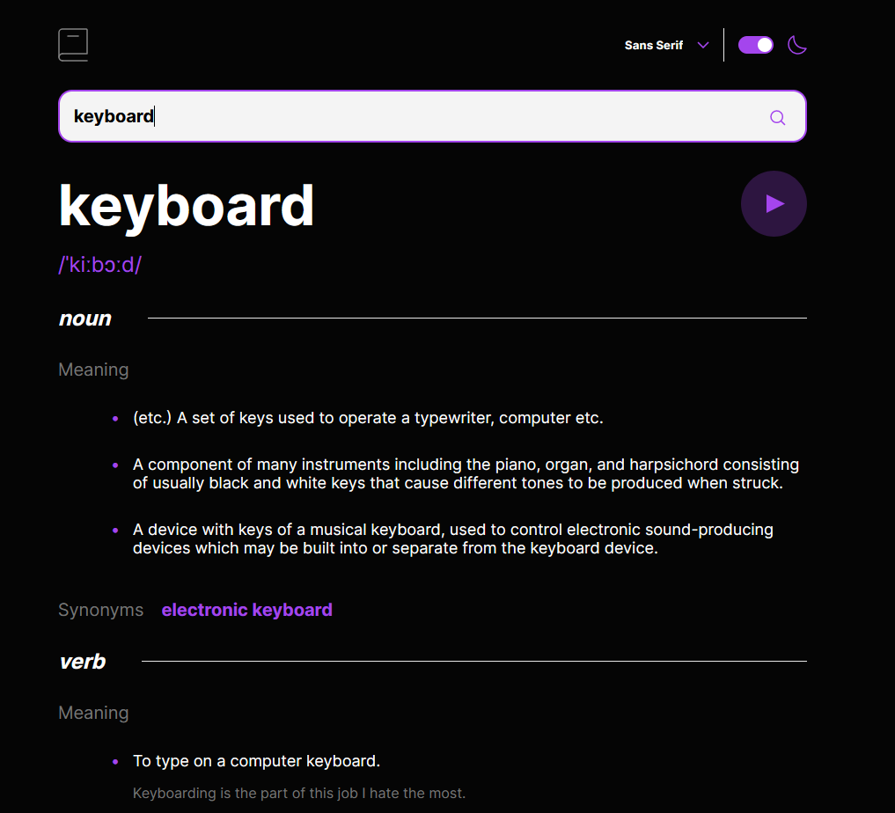

# Frontend Mentor - Dictionary web app solution

This is a solution to the [Dictionary web app challenge on Frontend Mentor](https://www.frontendmentor.io/challenges/dictionary-web-app-h5wwnyuKFL).

## Table of contents

- [Overview](#overview)
  - [The challenge](#the-challenge)
  - [Screenshot](#screenshot)
  - [Links](#links)
  - [Built with](#built-with)
  - [What I learned](#what-i-learned)
- [Author](#author)

## Overview

### The challenge

Users should be able to:

- Search for words using the input field
- See the Free Dictionary API's response for the searched word
- See a form validation message when trying to submit a blank form
- Play the audio file for a word when it's available
- Switch between serif, sans serif, and monospace fonts
- Switch between light and dark themes
- View the optimal layout for the interface depending on their device's screen size
- See hover and focus states for all interactive elements on the page

### Screenshot

### Links

Live Presentation accessible from Frontend mentor:

- Live Site URL: [Frontend Mentor](https://www.frontendmentor.io/profile/JJacobPR)

### Built with

- ReactJs
- Vite
- CSS Modules
- Fluid Design
- Mobile First Approach
- Semantic HTML5 markup

### What I learned

It was a great opportunity to learn something about font and theme management. I think it was also great opportunity to refine my API handling skills.

## Author

- Linkedin - [Jakub Janicki](https://www.linkedin.com/in/jakub-janicki-62229b244/)
- Frontend Mentor - [Frontend Mentor](https://www.frontendmentor.io/profile/JJacobPR)
