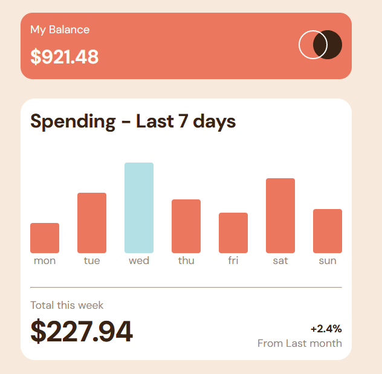

# Frontend Mentor - Expenses chart component solution

This is a solution to the [Expenses chart component challenge on Frontend Mentor](https://www.frontendmentor.io/challenges/expenses-chart-component-e7yJBUdjwt). Frontend Mentor challenges help you improve your coding skills by building realistic projects.

## Table of contents

- [Overview](#overview)
  - [The challenge](#the-challenge)
  - [Screenshot](#screenshot)
  - [Links](#links)
  - [Built with](#built-with)
- [Author](#author)

## Overview

### The challenge

Users should be able to:

- View the bar chart and hover over the individual bars to see the correct amounts for each day
- See the current day’s bar highlighted in a different colour to the other bars
- View the optimal layout for the content depending on their device’s screen size
- See hover states for all interactive elements on the page

### Screenshot

### Links

- Live Site URL: [Live site URL](https://superlative-choux-f5e042.netlify.app/)

### Built with

- ReactJs
- Vite
- SCSS
- CSS Modules
- Semantic HTML5 markup

## Author

- Linkedin - [Jakub Janicki](https://www.linkedin.com/in/jakub-janicki-62229b244/)
- Frontend Mentor - [Frontend Mentor](https://www.frontendmentor.io/profile/JJacobPR)
