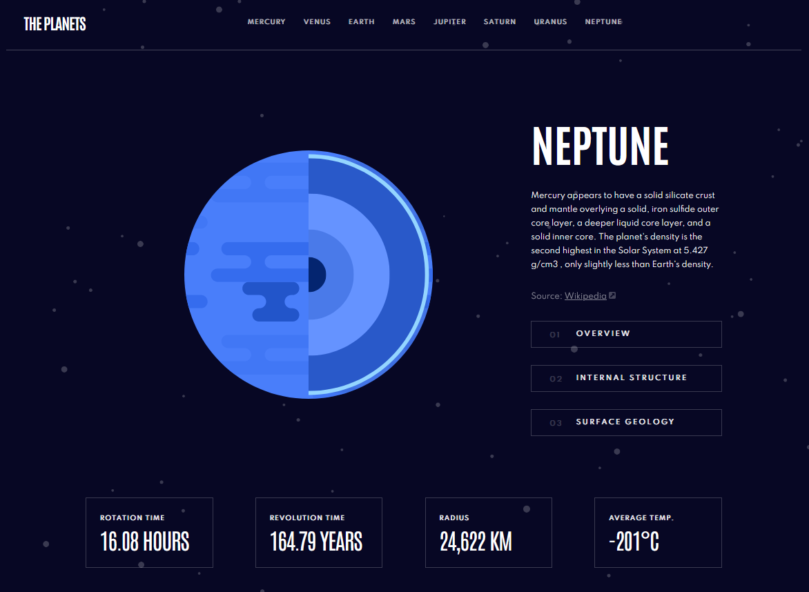

# Frontend Mentor - Planets fact site solution

This is a solution to the [Planets fact site challenge on Frontend Mentor](https://www.frontendmentor.io/challenges/planets-fact-site-gazqN8w_f).

## Table of contents

- [Overview](#overview)
  - [The challenge](#the-challenge)
  - [Screenshot](#screenshot)
  - [Links](#links)
  - [Built with](#built-with)
- [Author](#author)

## Overview

### The challenge

Users should be able to:

- View the optimal layout for the app depending on their device's screen size
- See hover states for all interactive elements on the page
- View each planet page and toggle between "Overview", "Internal Structure", and "Surface Geology"

### Screenshot

### Links

- Live Site URL: [Add live site URL here](https://main--rococo-tiramisu-b6589c.netlify.app/)

## Built with

- ReactJs
- React Router
- Vite
- SCSS
- CSS Modules
- Semantic HTML5 markup

## Author

- Linkedin - [Jakub Janicki](https://www.linkedin.com/in/jakub-janicki-62229b244/)
- Frontend Mentor - [Frontend Mentor](https://www.frontendmentor.io/profile/JJacobPR)
